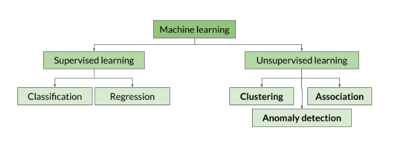

# Machine Learning

Machine Learning (ML) is a branch of artificial intelligence (AI) that allows systems to learn from data and make predictions or decisions without being explicitly programmed. There are three main types of machine learning:

---

## 1. Reinforcement Learning
Reinforcement learning focuses on training an agent to make a sequence of decisions. The agent learns by interacting with an environment and receiving rewards or penalties based on its actions. 

**Examples**:
- A robot deciding its path to reach a destination.
- A chess engine determining the next optimal move.  

This approach is widely used in **game theory**, robotics, and autonomous systems.

---

## 2. Supervised Learning
In supervised learning, the model learns from a labeled dataset, where each input has a corresponding output (target variable). The goal is to predict the target variable for new, unseen data.

**Key Concepts**:
- **Target Variable (Labels)**: The output we want the model to predict.
- **Observations**: Rows or examples in the dataset, representing the instances the model learns from.
- **Features**: Columns or attributes that provide input information to help predict the target.

**Workflow**:
1. Provide a dataset with input features and corresponding target labels (training data).
2. Train the model to learn patterns from the data.
3. Use the trained model to make predictions on new, unseen inputs.

**Examples**:
- Predicting house prices based on features like size, location, and number of rooms.
- Classifying emails as spam or not spam.

---

## 3. Unsupervised Learning
In unsupervised learning, the model works with an unlabeled dataset. The goal is to identify patterns, structures, or groupings in the data without predefined labels.

**Key Concepts**:
- **Clustering**: Grouping data points into clusters based on similarity (e.g., customer segmentation).
- **Dimensionality Reduction**: Simplifying data while preserving important features (e.g., Principal Component Analysis).

**Examples**:
- Grouping customers with similar purchasing behavior.
- Detecting anomalies in network traffic for cybersecurity.

---

### Summary Table

| Type                  | Input Data        | Output/Goal                     | Examples                                |
|-----------------------|-------------------|----------------------------------|----------------------------------------|
| Reinforcement Learning | Interaction with an environment | Sequential decision-making        | Chess engines, robotics               |
| Supervised Learning    | Labeled data     | Predicting target variable       | Spam detection, price prediction       |
| Unsupervised Learning  | Unlabeled data   | Finding patterns and structures  | Customer segmentation, anomaly detection |

## Supervised Learning:

### Types of Supervised Learning Tasks:

1. **Classification**:
   - **Definition**: Assigns a category or class label to the input data.
   - **Examples**:
     - Email classification: Spam or Not Spam.
     - Image classification: Recognizing cats, dogs, or other animals in photos.
     - Sentiment analysis: Classifying text as positive, negative, or neutral.

2. **Regression**:
   - **Definition**: Assigns a continuous value as the output, often used for predicting quantities.
   - **Examples**:
     - Predicting house prices based on features like size, location, and number of bedrooms.
     - Estimating a person’s weight based on height and age.
     - Forecasting stock prices or sales numbers.

## Unsupervised Learning:

Unsupervised learning is a type of machine learning where the model learns from unlabeled data. There is no target column or guide to indicate the desired output. Instead, the model analyzes the dataset and identifies patterns, structures, or relationships within the data.  

Unlike supervised learning, the model doesn't explain why it clusters data or chooses specific patterns—it's up to us to interpret the results and extract meaningful insights.  

### Key Applications of Unsupervised Learning:  

#### 1. **Clustering**:
   Clustering models group similar observations together based on patterns in the data.  
   - **Models**:
     - **K-Means**:
       - Requires specifying the number of clusters beforehand.
       - Example: Segmenting customers into groups based on purchasing behavior.  
     - **DBSCAN (Density-Based Spatial Clustering of Applications with Noise)**:
       - Does not require specifying the number of clusters but needs the minimum number of observations and a distance parameter to form a cluster.
       - Example: Identifying geographical regions of interest in spatial data.  

#### 2. **Anomaly Detection**:
   - Used for identifying data points that deviate significantly from the normal pattern or distribution.
   - **Examples**:
     - Detecting fraudulent transactions in financial datasets.
     - Identifying sensor malfunctions in IoT devices.

#### 3. **Association**:
   - Focuses on discovering relationships or associations between observations.
   - **Example**: 
     - Market Basket Analysis:
       - Understanding which products are frequently purchased together in retail (e.g., "If a customer buys bread, they are likely to buy butter").  
       - This can help design better marketing strategies or product recommendations.
---

